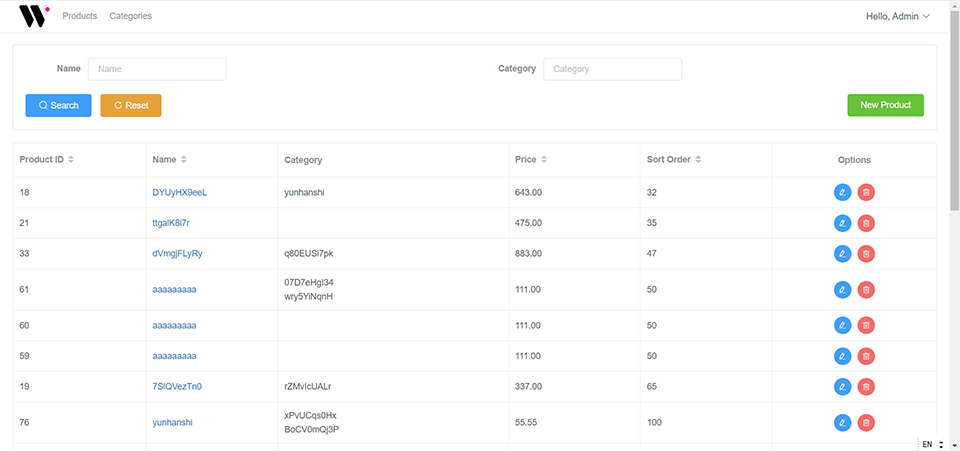

# The web co coding test solution
This is a practical assessment for The web co, this solutions base [Laravel 8](https://laravel.com/) and [Vue.js 3](https://github.com/vuejs/vue). 



## Installing

```bash
# Clone the project
git clone https://github.com/yunhanshi/thewebco.git

cd thewebco

# Copy .env
cp .env.example .env

# Run composer
composer install

# Migration and DB seeder (after changing your DB settings in .env)
php artisan migrate --seed

# Install key
php artisan key:generate

# Install dependency with NPM
npm install

# develop
npm run dev # or npm run watch

# Build on production
npm run production
```

## GraphQl
### Endpoint
```bash
<yourHost>/graphql
```
### List Example
```bash
{
  products(
    page: 2,
    page_size: 3,
    filter_name: "p",
    filter_category: "i"
  ) {
    id,
    name,
    category {
      id,
      name,
      sort_order
    }
    price,
    sort_order
  }
}
```
### Detail Example
```bash
{
  product(id: 5) {
    id,
    name,
    category {
      id,
      name,
      sort_order
    }
    price,
    sort_order
  }
}
```
### Create Example
```bash
mutation {
  createProduct(
    name: "aaaaaaaa",
    category_ids: [3,5,7],
    price: 55.55,
    sort_order: 666
  ) {id,name,price,sort_order}
}
```
### Update Example
```bash
mutation {
  updateProduct(
    id: 5,
    name: "bbbbbbb",
    category_ids: [20,22,24],
    price: 30.5,
    sort_order: 125
  )
}
```
### Delete Example
```bash
mutation {
  deleteProduct(
    id: 5
  )
}
```

## Run API test
### Product test
```bash
./vendor/bin/phpunit --filter ProductTest
```
### Category test
```bash
./vendor/bin/phpunit --filter CategoryTest
```
